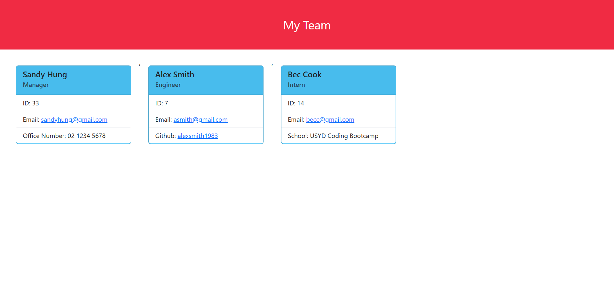

# Team profile generator
  
  ## Description
  This application is a tool that provides users to easily construct a professional webpage displaying basic information of each team members. This is very useful especially for businesses that wishes to create a "Contact us" webpage to display contact details and roles of their staff.
  This application takes in various inputs from the user regarding the content of the information they'd like to include, then organizes these data into a well-structured webpage. This will allow developers to save time on creating their own webpage from scratch.
  Below is a screenshot of a sample webpage that has been dynamically generated based on the user inputs:

  ## Table of Contents
  - [Description](#description)
  - [Installation](#installation)
  - [Usage](#usage)
  - [Contributing](#contributing)
  - [Test](#tests)
  - [Questions](#questions)
  ## Installation
  The Team profile generator requires npm Inquirer package to run in Visual Studio. You will need to install this version by entering "npm i inquirer" in your terminal. Once installed, simply enter "node index.js" in the terminal to run the application.
  ## Usage
  To initialize the application, enter node index.js to run the file. This will trigger a series of questions regarding each team member's personal details you wish to be displayed on your webpage. Follow the prompt to answer these questions, hit enter after you have finished. Once you have answered all required questions, you will be asked whether you'd like to add another team member. Once all team members have been entered, simply choose "I don't want to add anymore team members" and hit enter. A HTML file will be dynamically generated based on your answers. You can update the content of the README file at anytime by running the application again and re-entering your answers. See a walkthrough video of the application here: [Link to walkthrough video](https://drive.google.com/file/d/1y8VjcIOMEnXmupYF-B5LGNXf3A3-f0Dm/view)

  ## Contributing
  If you would like to contribute to this project, head to my GitHub page to see details of the application code. You can also contact me via my email below for any suggestions and feedback.
  ## Tests
  The application is tested through Jest. The super class, Employee, and its subclasses each have their test files under the test folder. 
  
  ## Questions
  Check out my projects on my GitHub account at https://github.com/Sandy5433
  . If you have any questions about the application, you can reach me via my email at sandyhung83@yahoo.com.tw 
  